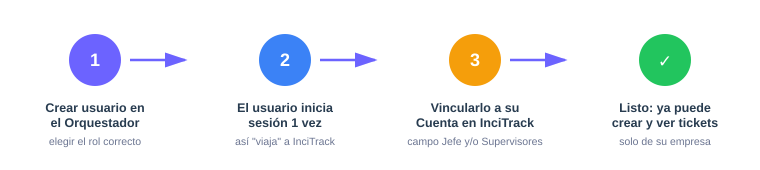
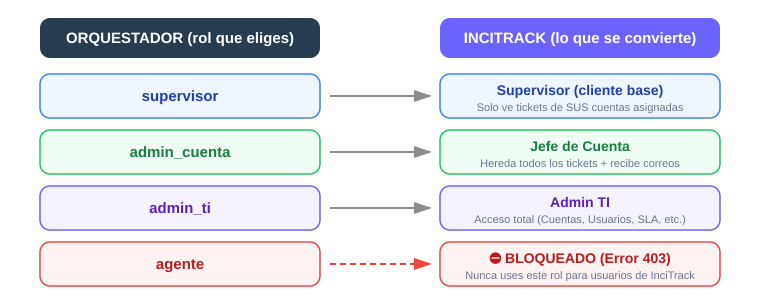
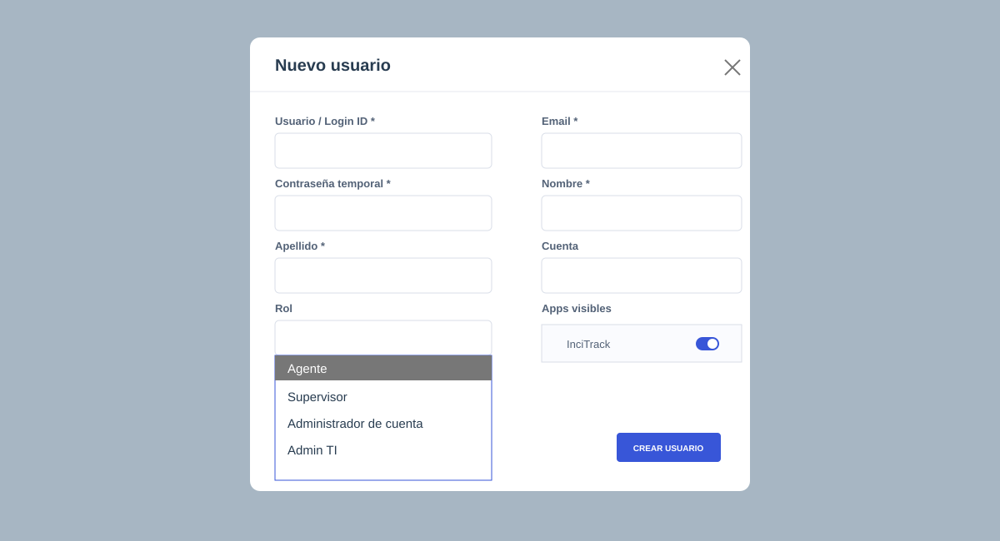
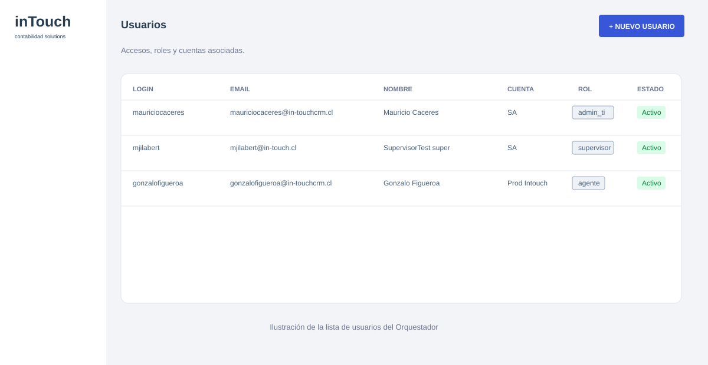
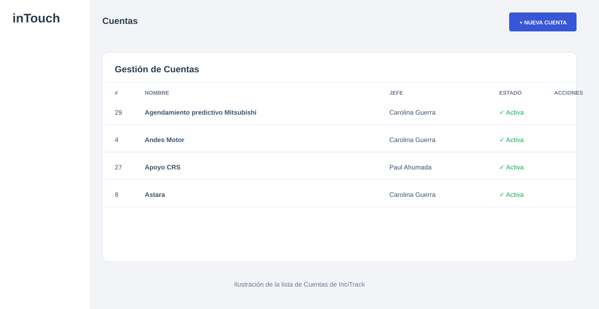
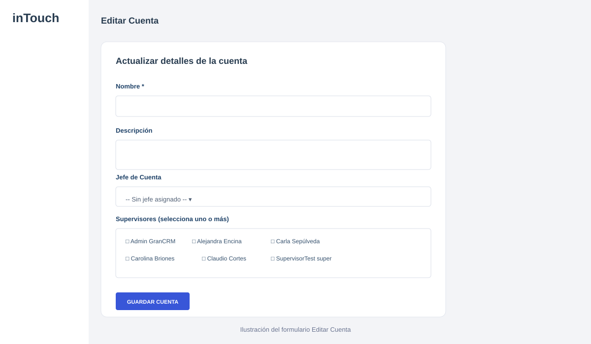
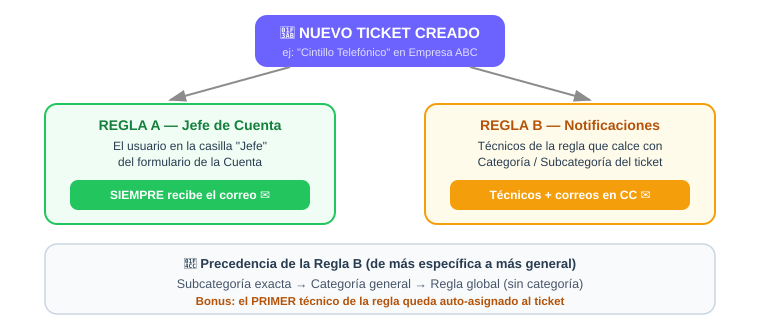
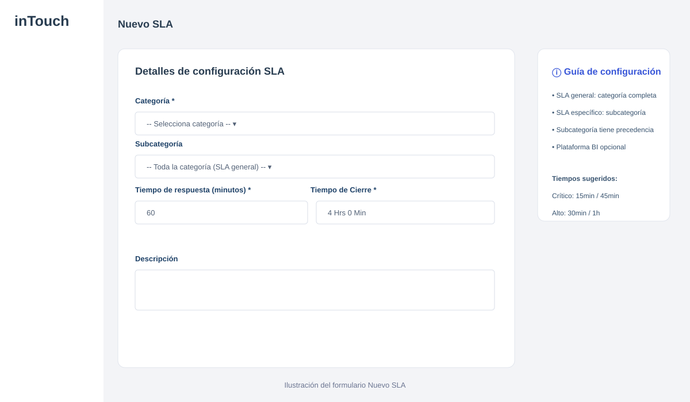

# Manual del Administrador — InciTrack
**Para: Equipo de Soporte/TI** · *Versión 2 — Agosto 2026*

Si estás leyendo este documento, significa que ahora tienes el control de la administración de accesos, cuentas y reglas de soporte dentro de InciTrack.

Este sistema trabaja en conjunto con el "Orquestador" (la plataforma principal donde nacen los usuarios). A continuación, te explico el flujo exacto que debes seguir en tu día a día para que todo funcione a la perfección.

---

## 1. El ciclo de vida de un Usuario

Cada vez que entre un nuevo cliente, empleado o cambie de puesto, tu trabajo se divide en pasos: primero en el Orquestador y luego en InciTrack.

### Paso 1: Crear el usuario en el Orquestador
Entra al panel del Orquestador y crea el usuario. El "secreto" aquí está en elegir el rol correcto, ya que InciTrack lo traducirá automáticamente:

* **Para el cliente base (usuario normal):** Asígnale el rol **`supervisor`**.
  * *¿Por qué?* Este perfil verá un panel limpio, y **solo** tendrá acceso a los tickets de las empresas (cuentas) que tú le asignes manualmente más adelante. No verá tickets de otros clientes.
* **Para el gerente o contraparte principal del cliente:** Asígnale el rol **`admin_cuenta`**.
  * *¿Por qué?* En InciTrack se traduce como **"Jefe de Cuenta"**. Este perfil es especial porque al vincularlo a una cuenta, heredará el acceso a todos los tickets de esa empresa y **recibirá correos automáticos** cada vez que alguien de su empresa levante una incidencia.
* **Para un resolutor interno de tu equipo (TI):** Asígnale el rol **`admin_ti`**.
  * *¿Por qué?* Se traduce como **"Admin TI"** y le da poderes totales, igual que tú.
* **⛔ NUNCA uses el rol `agente`:** InciTrack lo **bloquea con Error 403** (acceso denegado). Ese rol es para otros módulos del ecosistema, no para InciTrack.

> [!WARNING]
> **Importante:** El usuario **debe iniciar sesión al menos una vez** en el sistema para que su cuenta "viaje" desde el Orquestador hacia la base de datos de InciTrack. Hasta que eso ocurra, no aparecerá en las listas de InciTrack.

### Paso 2: Vincular al usuario a su Cuenta (en InciTrack)
Una vez que el usuario inició sesión por primera vez, debes "engancharlo" a la empresa a la que pertenece:

1. Abre **InciTrack** y ve a la pestaña **Cuentas**.
2. Presiona **Editar** en la cuenta correspondiente (ej: "Empresa ABC").
3. En el campo **"Jefe"**, busca y selecciona al usuario que definiste como `admin_cuenta` en el paso anterior.
4. En el campo **"Supervisores"**, agrega a todos los demás usuarios base (los que creaste como `supervisor`).

**¡Listo!** Al guardar, esas personas ya podrán levantar y ver tickets exclusivamente para esa cuenta.

> [!NOTE]
> **¿Por qué mi cliente no ve las pestañas Cuentas, Usuarios o Notificaciones?** Es por diseño: esas pestañas de administración **solo las ven los Admin TI**. Supervisores y Jefes de Cuenta solo ven *Dashboard*, *Tickets* y *Nuevo Ticket*.

---

## 2. Gestión de Correos y Notificaciones

InciTrack envía correos de forma automática basándose en **dos reglas**. Es crucial que entiendas cómo funcionan para evitar que personas equivocadas reciban alertas.

### Regla A: El Jefe de la Cuenta (Automático)
Cualquier usuario que esté seleccionado en la casilla **"Jefe"** dentro del formulario de una **Cuenta**, recibirá **siempre** un correo cuando se cree un ticket en esa empresa.
* *Solución de problemas:* Si alguien se fue de la empresa o ya no debe recibir alertas de un cliente, debes ir a la pestaña **Cuentas**, editar la empresa y borrarlo de la casilla "Jefe". (No basta con desactivar al usuario).

### Regla B: Las alertas para el equipo TI (Pestaña "Notificaciones")
¿Cómo sabe InciTrack a qué técnico avisarle cuando se cae un servidor o falla un cintillo? Usando la pestaña **Notificaciones** de tu menú lateral.

1. Ve a **Notificaciones** y crea una nueva regla.
2. Selecciona la **Categoría** (ej: "Equipamiento e Insumos") y la **Subcategoría** (ej: "Cintillo Telefónico").
3. En **Usuarios**, selecciona a los técnicos (Admins TI) que deben atender ese problema.
4. Puedes agregar correos externos en la sección "CC" si es necesario.

A partir de ese momento, si un cliente levanta un ticket de "Cintillo Telefónico", el correo le llegará a:
* Su Jefe de Cuenta (Regla A).
* Los técnicos que asignaste en esta regla (Regla B).

**📌 Precedencia de las reglas** (de más específica a más general): si existe una regla para la **subcategoría exacta**, manda esa. Si no, se usa la regla **general de la categoría**. Si tampoco hay, se usa la **regla global** (sin categoría).

**🎯 Bonus — Auto-asignación:** el **primer técnico** de la regla que calce quedará **asignado automáticamente** al ticket recién creado. Ordena bien tus reglas.

### 🔧 Si los correos dejan de llegar (checklist de diagnóstico)
1. ¿La **Cuenta** tiene un **Jefe** asignado y ese usuario tiene email registrado?
2. ¿Existe una **regla de Notificación** que calce con la categoría del ticket y está **activa**?
3. ¿Los técnicos de la regla tienen email registrado en el Orquestador?
4. Si todo lo anterior está correcto en pantalla → **avisa a Infraestructura**: el problema está en el servidor (credenciales SMTP). *Caso real — ago/2026: los correos fallaban porque al servidor de producción le faltaba la contraseña de aplicación de Gmail en su configuración; el error solo era visible en los logs del contenedor.*

---

## 3. SLA (Tiempos de Respuesta y Cierre)

En la pestaña **Config SLA** defines los tiempos máximos de atención. **Ojo:** las reglas SLA se configuran por **Categoría + Subcategoría** (y opcionalmente *Plataforma BI* si la categoría lo requiere), **no por prioridad**.

Cada regla SLA tiene **dos tiempos**:
* **Tiempo de respuesta:** cuánto tiene TI para *tomar* el ticket.
* **Tiempo de cierre:** cuánto tiene TI para *resolverlo* por completo.

El cumplimiento se mide en la pestaña **Estadísticas** (Centro de Analítica TI), donde verás el **% de cumplimiento SLA por servicio** y alertas de tickets estancados (más de 48 h sin resolverse).

> Las **prioridades** del ticket (Baja, Media, Alta, **Crítica**) son informativas y las elige quien crea el ticket; no mueven las reglas SLA.

---

## 4. Referencia rápida: Estados del ticket

| Estado | Significado |
|---|---|
| **Abierto** | Recién creado, nadie lo ha tomado. |
| **En Proceso** | Un técnico ya está trabajando en él. |
| **Resuelto** | El técnico lo dio por solucionado. |
| **Cerrado** | Solución confirmada / ticket archivado. |

*Tickets "estancados":* los que llevan **más de 48 horas** en Abierto o En Proceso. Aparecen alertados en Estadísticas.

---

> [!TIP]
> **✅ Resumen del Día a Día:**
> 1. Nuevo cliente → créalo en el **Orquestador** (rol `supervisor` o `admin_cuenta`).
> 2. El cliente **inicia sesión** por primera vez.
> 3. Entras a InciTrack → **Cuentas** → lo vinculas a su empresa (Jefe / Supervisores).
> 4. (Opcional) Ajustas los correos por categoría en **Notificaciones** y los tiempos en **Config SLA**.
