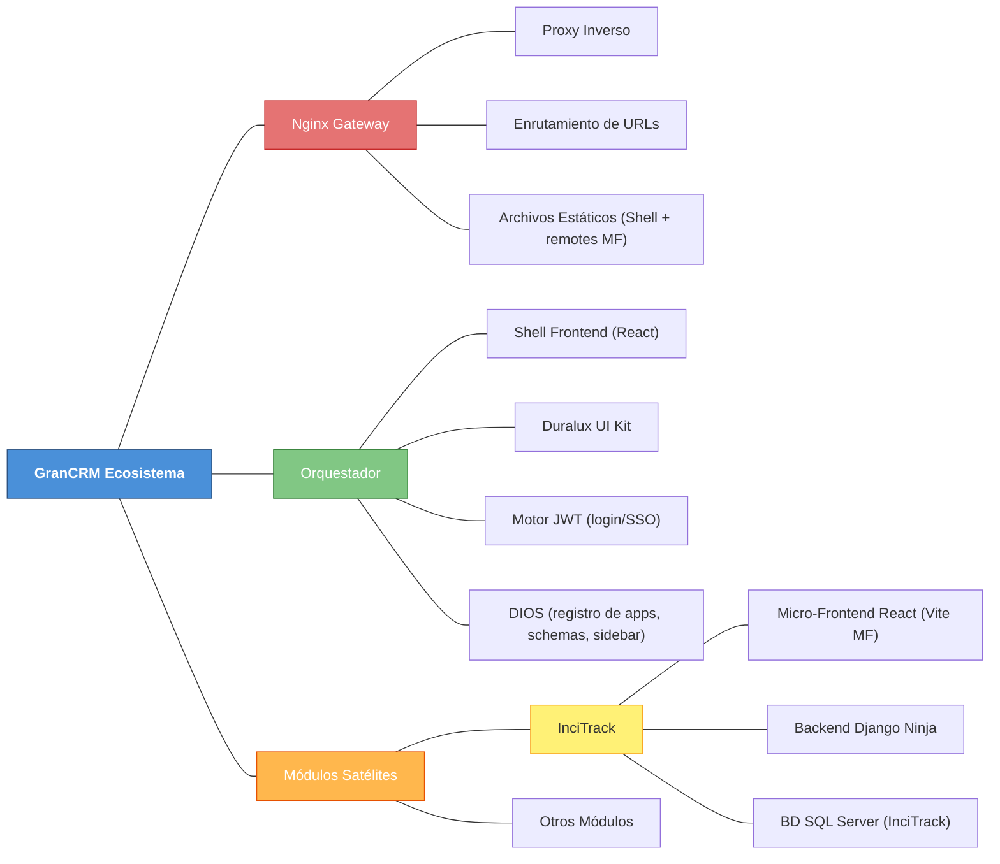
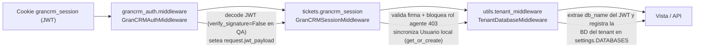
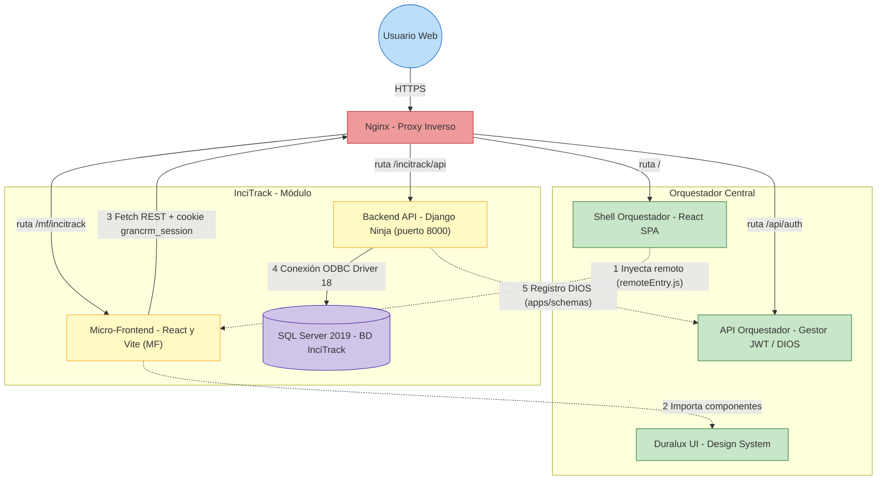
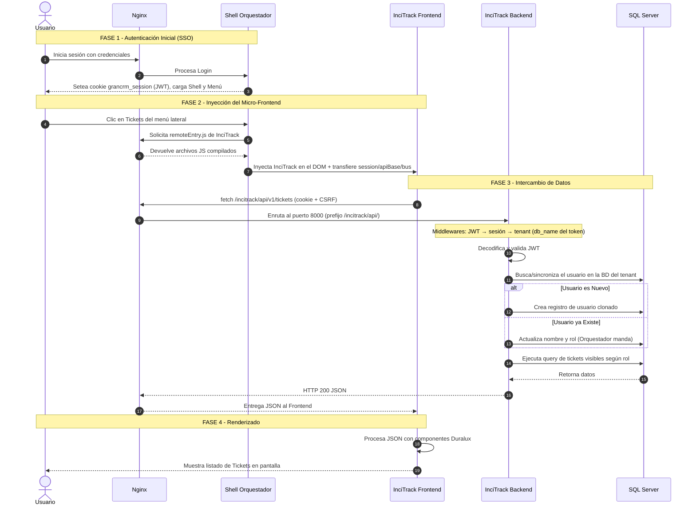
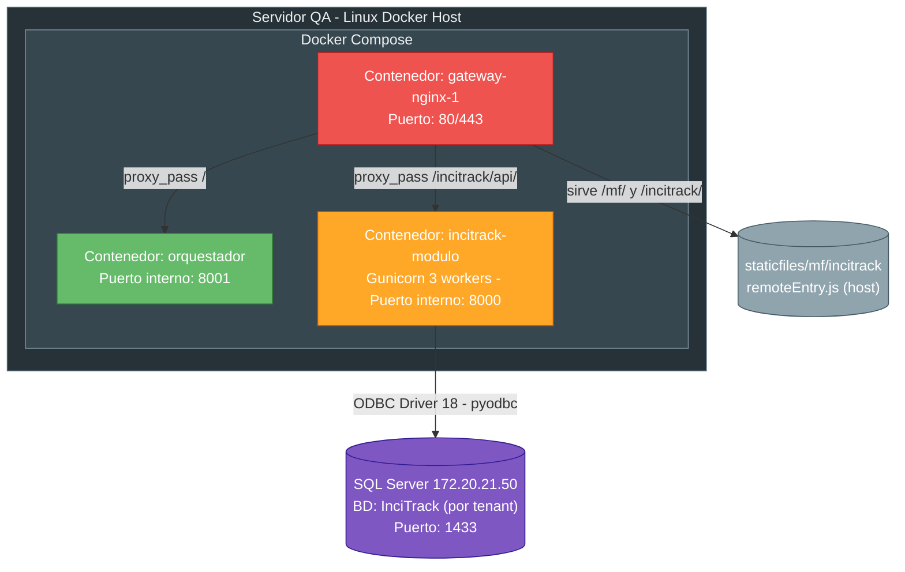
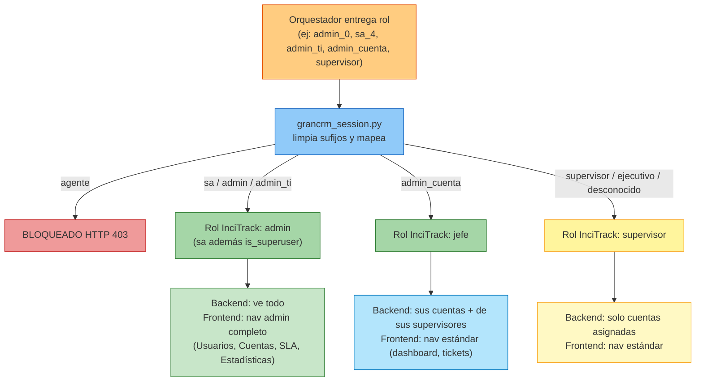

# Arquitectura y Flujo del Ecosistema GranCRM e InciTrack

Este documento detalla a nivel arquitectónico e infraestructural cómo se componen y comunican los distintos sistemas del ecosistema GranCRM, haciendo énfasis en el ciclo de vida e inyección del módulo InciTrack.

**Vigencia:** documento alineado con el código actual de `grancrm/incitrack/` (Django 4.2 + Django Ninja + React/Vite Module Federation + SQL Server 2019).

---

## 1. Mapa Conceptual del Ecosistema



**Flujo resumido de una petición:**
1. El navegador entra a Nginx (gateway único, HTTPS).
2. Nginx enruta por prefijo de URL:
   - `/` → Shell del Orquestador.
   - `/mf/incitrack/remoteEntry.js` → archivos compilados del micro-frontend.
   - `/incitrack/` (catch-all SPA) → `index.html` del Shell (Module Federation lo resuelve).
   - `/incitrack/api/`, `/incitrack/admin/`, `/incitrack/media/` → backend Django (puerto interno 8000).
3. El Shell inyecta InciTrack en el DOM y le transfiere `session`, `basename`, `apiBase` y `bus` (contrato de props).
4. El frontend de InciTrack llama a su API REST; el backend valida la cookie `grancrm_session` (JWT), sincroniza el usuario y responde JSON.

---

## 2. Descripción Detallada de Componentes

### A. Nginx — Proxy Inverso y Puerta de Enlace
Todas las peticiones del navegador llegan primero a Nginx, que actúa como router de tráfico y servidor estático.

* **Enrutamiento:** lee el prefijo de la URL y decide el destino (ver `deploy/nginx-incitrack.conf`).
* **Estáticos:** sirve `remoteEntry.js` y el resto de archivos compilados de cada remote desde `/home/admincrm/staticfiles/...`.
* **Seguridad básica:** oculta `X-Frame-Options` en la API y añade `Content-Security-Policy: frame-ancestors 'self'` para permitir el iframe/inyección del remote.

### B. El Orquestador — Shell, Duralux, JWT y DIOS
Es la plataforma "padre".

* **Shell (React):** cascarón que pinta el menú lateral, la barra superior y mantiene el ciclo de vida de la sesión. Carga los remotes de Module Federation y los inyecta.
* **Duralux (Sistema de Diseño):** UI Kit propio (`@duralux/ui`, instalado vía GitHub). Botones, tablas, modales, tarjetas, `ShellHeader`, `ShellNav`, `ThemeProvider`, etc. Garantiza coherencia visual entre módulos.
* **Motor de Autorización (JWT):** al hacer login emite una cookie `grancrm_session` con un JWT HS256 que contiene `user_id`, `email`, `nombre`, `rol` (dinámico, con sufijos: `admin_0`, `sa_4`), `tenant_id`, `db_name` y `apps`.
* **DIOS (`dios.json`):** cada app declara su manifiesto (urls, rol, sidebar, `remote_entry_url`). El Orquestador lee estos manifiestos para construir el menú y registrar la app. InciTrack se registra automáticamente al arrancar vía `utils/dios_registration.py` (POST a `/internal/register-app/` y `/internal/schema-updated/`).

### C. InciTrack — Módulo Desacoplado
Aplicación especializada en gestión de tickets. Diseñada para vivir/morir de forma independiente (tolerancia a fallos).

1. **Frontend (Micro-Frontend React):**
   * Se compila con Vite + `@module-federation/vite` (`frontend/vite.config.ts`).
   * Expone el remote `./App` (`src/App.tsx`) con `remoteEntry.js`.
   * Comparte `react`, `react-dom` y `react-router-dom` como singletons con el Shell.
   * Contrato de props (`GranCrmRemoteProps`): `contractVersion` ('1'), `basename`, `apiBase`, `session` y `bus` (EventBus).
   * En desarrollo corre en el puerto 8010 con proxy `/incitrack` → `127.0.0.1:8000`.
2. **Backend (Django + Django Ninja):**
   * API JSON en `/incitrack/api/v1/` con auth por cookie JWT.
   * Modelos propios en `tickets/models.py` (SQL Server).
   * Lógica de negocio: visibilidad por rol, auto-asignación, SLA, auditoría, avisos TI, correos.
3. **Autenticación Híbrida (`grancrm_session.py`):**
   * No confía en la BD del Orquestador: valida el JWT de la cookie y **sincroniza** (clona/actualiza) al usuario dentro de la BD local de InciTrack antes de procesar la petición.

---

## 3. Seguridad y Autenticación

Cadena de middleware (orden en `MIDDLEWARE` de `settings.py`):



**Reglas clave:**
* **Mapeo de roles** (Orquestador → InciTrack, en `grancrm_session._ROLE_MAP`):

  | Rol Orquestador | Rol InciTrack | Notas |
  |---|---|---|
  | `agente` | — (bloqueado) | HTTP 403 + limpieza de cookie |
  | `sa` | `admin` | además `is_superuser=True` |
  | `admin`, `admin_ti` | `admin` | |
  | `admin_cuenta` | `jefe` | |
  | `supervisor`, `ejecutivo` | `supervisor` | `ejecutivo` es fallback legacy |
  | desconocido | `supervisor` | fallback |

  Los sufijos numéricos se limpian antes de mapear (ej. `admin_0` → `admin`, `sa_4` → `sa`).
* **Delegación:** el Orquestador es la fuente de verdad de autenticación. InciTrack solo recibe usuarios vía JWT y los sincroniza en su BD (sin password propio utilizable).
* **Comportamiento ante token inválido/expirado:** en rutas `/incitrack/api/` responde JSON 401 (para que el frontend emita `grancrm:sessionExpired`); en rutas de plantilla redirige 302 al login del Orquestador.
* **CSRF:** el frontend envía `X-CSRFToken` leída de la cookie `csrftoken` en todos los POST/PUT/DELETE (`frontend/src/api.ts`). Las cookies viajan con `credentials: 'include'`.
* **Sesión expirada:** `api.ts` escucha 401, dispara el evento `grancrm:sessionExpired` y el `bus` del Shell redirige al login.

> **Advertencia QA→Producción:** hoy existen **bypasses temporales** que NO deben llegar a producción (ver §13 Riesgos Conocidos): verificación de firma JWT deshabilitada, chequeo de `apps` comentado y endpoint de descarga de adjuntos sin auth.

---

## 4. Multi-Tenencia y Base de Datos

InciTrack soporta múltiples tenants usando el esquema "una base de datos por tenant".

* **Cómo se decide la BD:** el JWT contiene `db_name` y `tenant_id`. `TenantDatabaseMiddleware` registra dinámicamente la BD del tenant en `settings.DATABASES` (misma config que `default`, cambiando solo `NAME`).
* **Enrutamiento:** `utils/tenant_router.TenantDatabaseRouter` redirige todos los reads/writes al DB del tenant actual (`db_for_read`/`db_for_write`). Las migraciones solo corren contra `default` (`allow_migrate`).
* **BD base:** SQL Server 2019, `mssql-django` + `pyodbc` + ODBC Driver 18, `TrustServerCertificate=yes`. En QA: host `172.20.21.50`, DB por defecto `InciTrack` (según `.env`). En `dios.json`, `source_db: "QAIntouch"` es la BD fuente del Orquestador, no la del módulo.
* **Sincronización de esquemas:** `dios_registration.notify_schema_updated()` avisa a DIOS para que aplique cambios de esquema a todos los tenants en background.

> **Riesgo:** como el `db_name` proviene del JWT y hoy la firma no se verifica, un token forjado podría apuntar a cualquier base del host (ver §13).

---

## 5. Modelo de Datos

`tickets/models.py` (todas bajo el DB del tenant):

| Modelo | Propósito | Detalles clave |
|---|---|---|
| `Usuario` | Usuario autenticado (AbstractUser) | Login por `email` (`USERNAME_FIELD`), roles `admin`/`jefe`/`supervisor`, campo `activo`. Sincronizado desde el JWT. |
| `Cuenta` | Cliente/empresa atendida | `jefe` (FK, rol jefe) y `supervisores` (M2M, rol supervisor). |
| `Categoria` | Clasificación principal (BD-first) | `slug`, `orden`, `requiere_plataforma_bi` (muestra selector PowerBI/QlikView). |
| `Subcategoria` | Clasificación secundaria | `unique_together` (categoria, slug). |
| `Ticket` | Incidencia | estado/prioridad (choices), `categoria`/`subcategoria`/`plataforma_bi`, campo legacy `tipo_incidencia`, `asignado_a` (admin), `fue_reasignado`, `fecha_resolucion`. |
| `Adjunto` | Archivo del ticket/comentario | `archivo` (FileField), `nombre_original`/`nombre_guardado`, subido por. |
| `Comentario` | Conversación del ticket | `interno` (visible solo admin/jefe). |
| `NotificacionServicio` | Quién recibe correos y auto-asignación | por categoria/subcategoria o global, `usuarios` (M2M admin), `emails_cc`. |
| `ConfiguracionSLA` | SLA por categoría/subcategoría | `tiempo_respuesta_minutos`, `tiempo_cierre_minutos`, `unique_together` (categoria, subcategoria, plataforma_bi). |
| `AvisoTI` | Avisos internos del panel | expiran a las 24h, tipos info/advertencia/critico/resolucion. |
| `TicketAudit` | Auditoría de cambios | campo_modificado, valor_anterior/nuevo, usuario, fecha. |

**Visibilidad por rol** (helpers en `tickets/mixins.py`):

* `admin` → ve todo.
* `jefe` → sus cuentas **más** las cuentas donde estén asignados sus supervisores dependientes.
* `supervisor` → solo las cuentas donde está asignado directamente.
* `tickets_visibles(usuario)` deriva de `cuentas_visibles(usuario)`.
* Regla adicional en lista/dashboard: admin ve por defecto solo sus tickets asignados (`ver_todos` para ver todo); usuarios normales ven lo que crearon.

---

## 6. API REST (Django Ninja)

Definida en `tickets/api.py` (objeto `api = NinjaAPI(auth=grcrm_auth)`), servida en `/incitrack/api/v1/`. El auth lee `request.jwt_payload` (seteado por el middleware).

**Endpoints por grupo:**

| Grupo | Rutas | Acceso |
|---|---|---|
| Dashboard | `GET /dashboard/` | Autenticado (stats, urgentes, mis activos, auditoría) |
| Tickets | `GET/POST /tickets/`, `GET/PUT /tickets/{id}/`, `POST /tickets/{id}/cerrar/` | Autenticado; editar/cerrar con reglas por rol |
| Comentarios | `POST /tickets/{id}/comentarios/` | Autenticado (supervisor no crea internos) |
| Adjuntos | `POST /tickets/{id}/adjuntos/`, `POST /tickets/{id}/comentarios/{cid}/adjuntos/`, `GET /adjuntos/{id}/download/` | Subida autenticada; **descarga sin auth (riesgo, ver §13)** |
| Lookups | `/lookups/categorias/`, `/lookups/cuentas/`, `/lookups/subcategorias/`, `/lookups/sla/` | Autenticado |
| Usuarios | CRUD `/usuarios/` | Solo `admin` |
| Cuentas | CRUD `/cuentas/` | Lista: admin o jefe; mutaciones: solo admin |
| Notificaciones | CRUD `/notificaciones/` | Solo `admin` |
| SLA | CRUD `/sla/` | Solo `admin` (API) / `superusuario` (plantillas) |
| Avisos TI | `GET/POST /avisos/`, `DELETE /avisos/{id}/` | GET autenticado; POST/DELETE solo admin |

**Auto-asignación de responsable TI:** al crear un ticket se busca `NotificacionServicio` con precedencia `subcategoria → categoria general → global`; el primer `usuario` admin de la notificación se asigna como `asignado_a`.

**Correos (`tickets/email_service.py`):** `notificar_nuevo_ticket` envía en un `threading.Thread` (daemon) al Jefe de Cuenta + Admins TI de la notificación + CC. Los fallos quedan en `docker logs`.

**Backward-compat:** los endpoints del dashboard devuelven `tickets_recientes`/`mis_tickets_activos` para compatibilidad con el frontend cacheado.

---

## 7. Frontend (Micro-Frontend React)

Estructura principal:

```
frontend/src/
├── main.tsx          # Dev shell (bootstrap, ShellHeader/Nav de @duralux/ui, login vía /api/v1/me/)
├── App.tsx           # Remote expuesto: rutas + postMessage grancrm:nav + RoleGuard
├── api.ts / lib/api.ts # Cliente HTTP (fetch con cookie + CSRF) y wrappers tipados
├── context.tsx       # GranCrmProvider, useSession, useRole, normalizeRole
├── pages/            # Dashboard, TicketList/Detail/Form, Usuarios, Cuentas, Notificaciones, SLA, Estadísticas
├── components/       # AvisosTIPanel, EstadoBadge, RoleGuard, duralux/* (charts, cards)
└── apiTypes.ts       # Tipos de respuesta de la API
```

**Puntos clave:**
* **Contrato con el Shell:** `contractVersion === '1'`; si no coincide, el remote se rehúsa a montar.
* **Navegación:** `App.tsx` envía `window.parent.postMessage({ type: 'grancrm:nav', items })` con los ítems según rol normalizado (`sa`/`admin` ven sección de administración). Se reenvía a los 100ms por una race condition del Shell.
* **Gating de rutas admin:** `RoleGuard roles={['sa','admin']}` en las rutas `/admin/*`, `/sla/*`, `/estadisticas`. **Importante:** el gating usa `normalizeRole` del frontend, que NO coincide exactamente con el mapeo del backend para `admin_cuenta` (ver §13).
* **CSRF + sesión:** `credentials: 'include'` en todos los fetch; POST/PUT/DELETE con `X-CSRFToken`. Un 401 dispara `grancrm:sessionExpired`.
* **Pegado de imágenes (Ctrl+V):** soportado en `TicketFormPage` (creación) y `TicketDetailPage` (comentarios).
* **Cache del navegador:** tras desplegar el remote, exigir recarga forzada (F12 → "Cargar de forma rígida"), de lo contrario el Shell inyecta código viejo (`Cannot read properties of undefined`).

---

## 8. Diagrama de Componentes — Conexiones de Red



---

## 9. Diagrama UML de Secuencia — Flujo Completo (End-to-End)



---

## 10. Diagrama de Despliegue — Contenedores Docker



**Detalles del contenedor InciTrack (`Dockerfile`):**
* Imagen base `python:3.11-slim` + `msodbcsql18` (Microsoft ODBC para SQL Server).
* `requirements.txt`: Django 4.2, `mssql-django`, `pyodbc`, `gunicorn`, `Pillow`, `PyJWT`, `django-ninja`, `whitenoise`, `python-dotenv`.
* `collectstatic` en build; en runtime `gunicorn incitrack.wsgi:application --bind 0.0.0.0:8000 --workers 3 --timeout 120`.

---

## 11. Diagrama de Flujo de Roles — dios.json y Autorización



**Comportamiento del dashboard según rol:**
* `admin`: por defecto ve solo sus tickets asignados; con `ver_todos=1` ve todo.
* `jefe`/`supervisor`: ven los tickets activos de su cartera (cuentas visibles).
* La tarjeta "Por Cerrar en 4h" y los tabs "Últimos Eventos / Mis Pendientes / Por Vencer SLA" se alimentan del endpoint `/dashboard/`.

---

## 12. Flujo de Trabajo y Despliegue (QA)

1. Cambios de código en local (Windows).
2. `git push` a `main` (GitHub). **La carpeta `249/` NO se sube** (está en `.gitignore`).
3. En el servidor (PuTTY): `cd /home/admincrm/grancrm && git pull`.
4. **Backend:** si cambió código Python o dependencias → reconstruir el contenedor:
   ```
   sudo docker compose up -d --build incitrack-modulo
   ```
   Si cambiaron modelos → `sudo docker compose exec incitrack-modulo python manage.py migrate`.
5. **Frontend:** se compila en el host y el contenedor lo absorbe:
   ```
   cd incitrack/frontend
   export PATH="/home/admincrm/.node20/bin:$PATH"
   pnpm install && pnpm build      # escribe remoteEntry.js en staticfiles/mf/incitrack
   cd ../..
   sudo docker compose up -d --build incitrack-modulo
   ```
6. **`dios.json`:** si se modificó (urls, rol, sidebar) hay que reiniciar el módulo para que dispare `dios_registration.py`:
   ```
   sudo docker compose restart incitrack-modulo
   ```
7. **`.env`:** tras editarlo, NO basta con `restart` — usar `sudo docker compose up -d`.
8. Pedir al usuario vaciar la caché del navegador (recarga forzada).

> **Importante:** no confundir `DB_PASSWORD` con `GRANCRM_JWT_SECRET` al editar el `.env`.

---

## 13. Casos Especiales, Puntos Clave y Riesgos Conocidos

### Casos especiales
* **Cache Vite:** desplegar el remote sin purgar caché del navegador rompe la app (`Cannot read properties of undefined`). Siempre recarga forzada.
* **Roles dinámicos:** limpiar sufijos (`admin_0`) antes de mapear; `RoleGuard` del frontend usa `normalizeRole`.
* **Esquemas Pydantic/Ninja:** si un esquema devuelve claves omitidas (valores vacíos), el frontend se rompe. Por eso algunos endpoints usan `response={200: dict}` o `Optional[...] = None` para conservar las claves.
* **Frontend y API base:** el frontend usa `apiBase` (prop del Shell) vía `configureApiBase()`; no hardcodea el prefijo en cada fetch.
* **Correos:** `email_service.py` corre en `threading.Thread` (daemon); fallos quedan en `docker logs`.

### Riesgos conocidos (levantados en revisión de código)
1. **CRÍTICO — Firma JWT deshabilitada (QA):** `grancrm_auth/middleware.py` y `grancrm_auth/ninja_auth.py` decodifican con `verify_signature=False`. Además `grancrm_session.py` intenta varios secretos hardcodeados. Rehabilitar verificación antes de producción.
2. **CRÍTICO — `.env` commiteado con credenciales reales** (`DB_PASSWORD`, `EMAIL_HOST_PASSWORD`, IP del SQL Server). Sacar del repo (`.gitignore` + `git rm --cached`) y rotar secretos.
3. **CRÍTICO — Chequeo de `apps` comentado** en `grancrm_session.py`: cualquier usuario del Orquestador puede entrar a InciTrack sin que su token incluya la app.
4. **ALTO — `GET /adjuntos/{id}/download/` con `auth=None`:** descarga de adjuntos sin autenticación con solo conocer el id. Proteger con la sesión JWT o token firmado.
5. **ALTO — `db_name` del JWT sin verificar** permite elegir cualquier BD del host (multi-tenant por token forjado).
6. **MEDIO — Rol `admin_cuenta` inconsistente:** el frontend (`normalizeRole`) lo mapea a `admin` (muestra nav de administración), pero el backend lo mapea a `jefe` → 403 en las rutas admin. Alinear ambos mapeos.
7. **MEDIO — `/incitrack/api/v1/me/` no existe** pero `main.tsx` (dev shell) lo consulta al arrancar → el shell local no inicia. Definir el endpoint o ajustar el bootstrap.
8. **MEDIO — Semántica de "Por Cerrar":** en la API (`api.py`) cuenta todos los abiertos/en_proceso; en la vista clásica (`views.py`) cuenta solo la ventana 20–24h. Unificar.
9. **MEDIO — Cerrar vía `PUT /tickets/{id}/` (estado=cerrado)** no setea `fecha_resolucion` ni exige el comentario previo del admin que sí exige `/cerrar/`. Centralizar el cierre en `Ticket.cerrar()`.
10. **BAJO — `SECRET_KEY` inseguro por defecto** si no se define `DJANGO_SECRET_KEY` en el entorno.
11. **BAJO — `print(...)` de depuración** con emails y roles repartidos por la API/sesión → ruido e info sensible en logs.
12. **BAJO — Duplicados y artefactos:** `tickets/settings.py` es copia de `incitrack/settings.py`; se commitean `.bak`, `main.tsx.bak`, `.mf/diagnostics/latest.json`, `settings.py.bak-fase0`.

---

## 14. Próximos Pasos (Paso a Producción)

1. **Configuración de Producción:** BD en `172.20.21.3` (IP física `172.20.21.10`), URL `https://dash.in-touchcrm.cl/login/?next=%2F`.
2. **Archivos Base:** usar la carpeta `PRODUCCION/` para `dios_incitrack.json`, `env_incitrack` y demás configurables, clonables a producción.
3. **Antes de producción, resolver los riesgos 1–6 de la §13** (firma JWT, `.env`, acceso por apps, descarga de adjuntos, tenant, mapeo de roles) y definir `DJANGO_SECRET_KEY` real.
