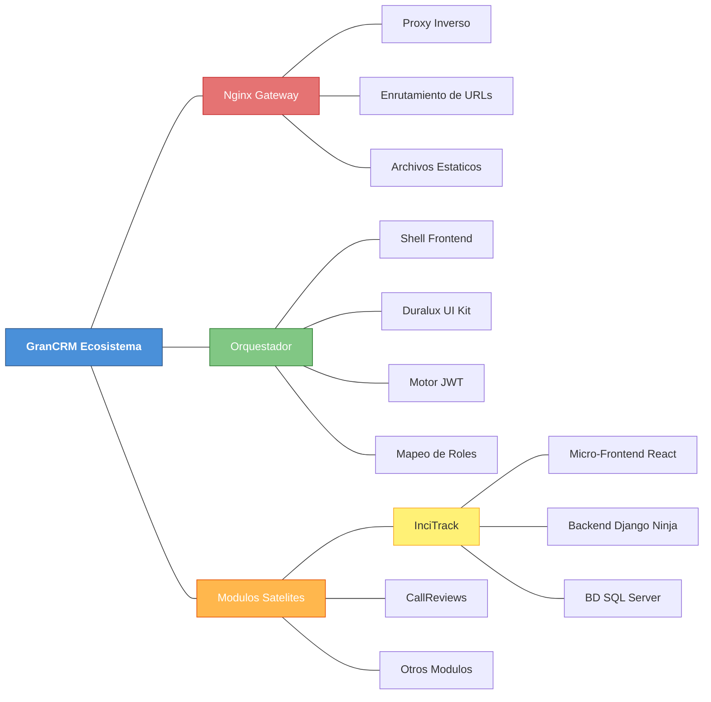
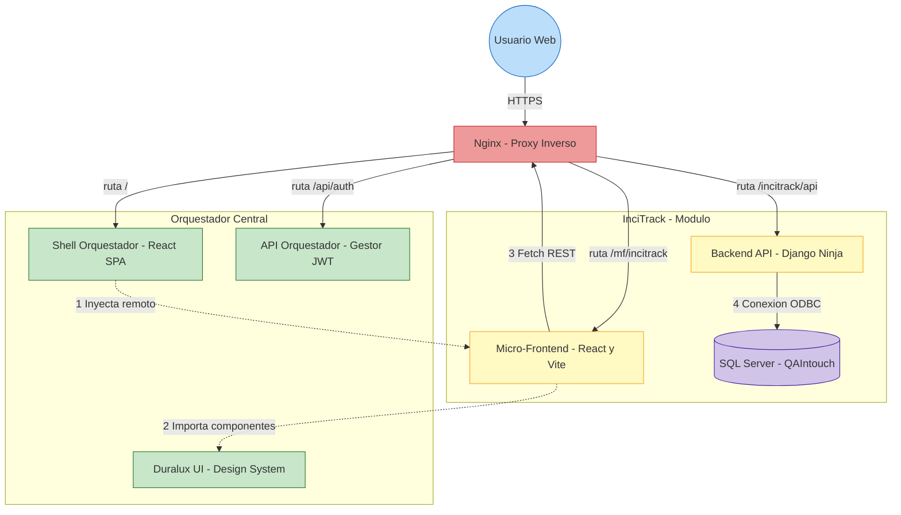
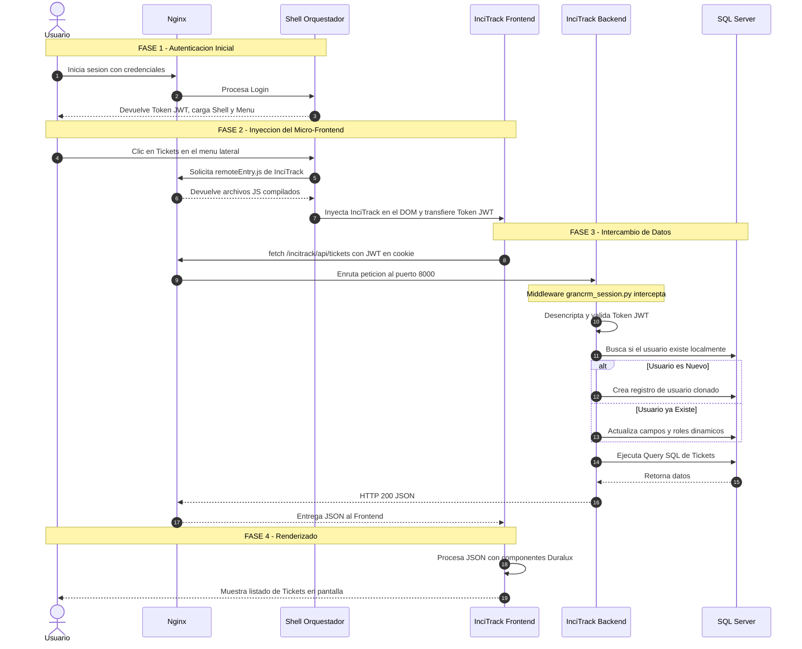
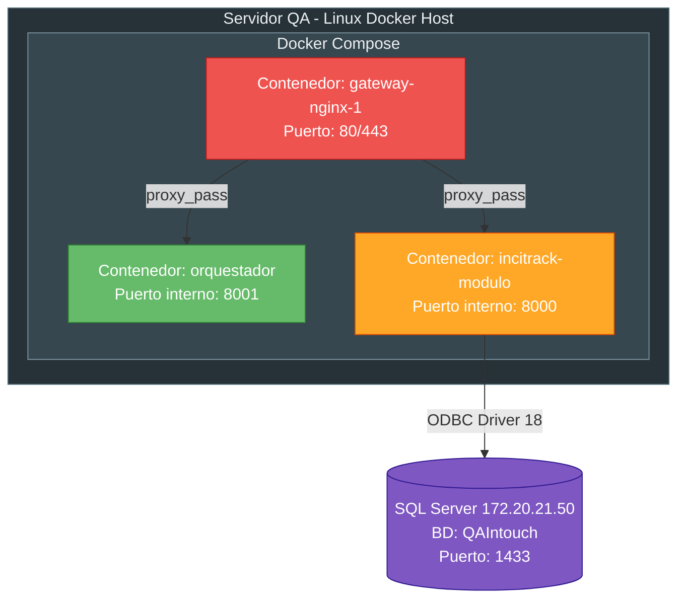
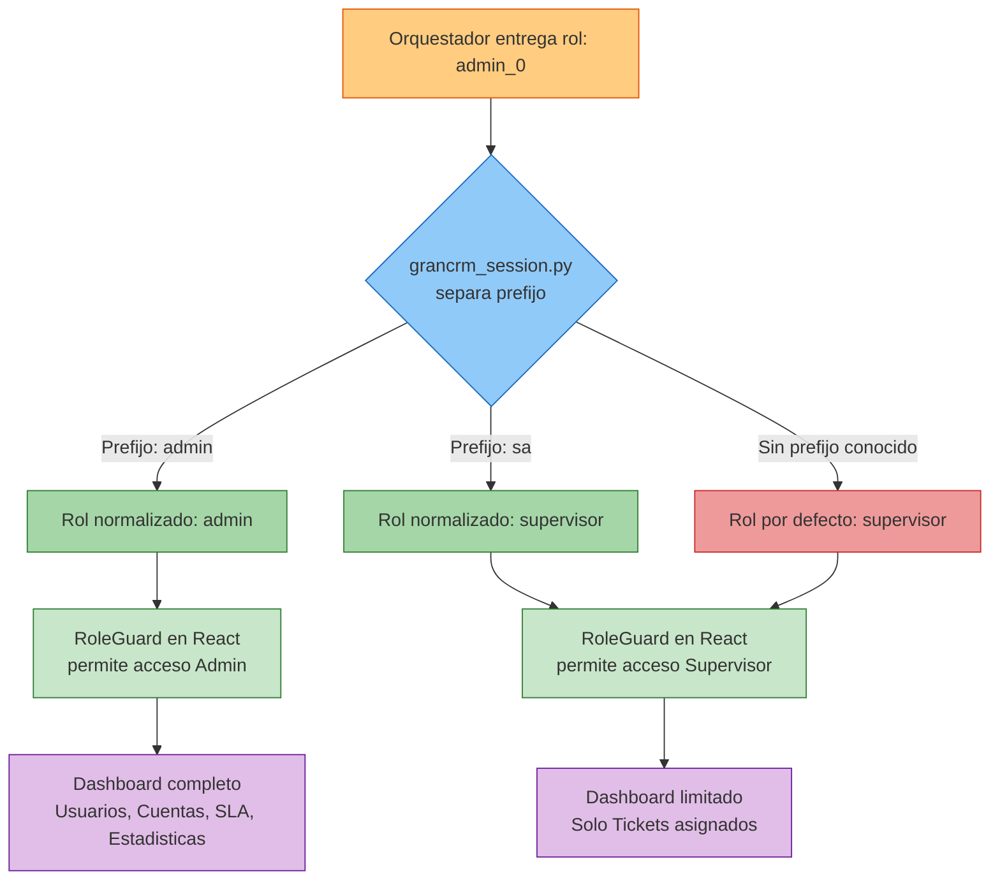

# Arquitectura y Flujo del Ecosistema GranCRM e InciTrack

Este documento detalla a nivel arquitectónico e infraestructural cómo se componen y comunican los distintos sistemas del ecosistema GranCRM, haciendo énfasis en el ciclo de vida e inyección del módulo InciTrack.

---

## 1. Mapa Conceptual del Ecosistema

A continuación, se muestra cómo se organiza el universo de componentes en GranCRM:

---

## 2. Descripcion Detallada de Componentes

### A. Nginx — El Proxy Inverso y Puerta de Enlace
Actua como el guardia de trafico de toda la red. Todas las peticiones del navegador de los usuarios llegan primero a Nginx.
*   **Funcion Principal:** Lee la URL de la peticion y decide a que contenedor de Docker redirigirla.
*   **Ejemplo:** Si pides `/`, te envia al Shell del Orquestador. Si pides `/mf/incitrack/`, Nginx sirve los archivos estaticos de React compilados del frontend de InciTrack. Si la peticion es `/incitrack/api/`, redirige el trafico al puerto interno donde escucha el backend en Python.

### B. El Orquestador — Shell y Duralux
Es la plataforma "padre" de la aplicacion.
*   **Shell (Frontend en React):** Es el cascaron que envuelve todo. Se encarga de pintar el menu lateral, la barra superior y mantener el ciclo de vida del usuario activo.
*   **Duralux (Sistema de Diseno):** Es la libreria de componentes propios (UI Kit). Contiene el diseno y la logica de los botones, tablas, pestanas y modales. Esto garantiza que sin importar quien programe un submodulo, todo se vea exactamente igual, manteniendo la coherencia de la marca.
*   **Motor de Autorizacion (JWT):** Genera credenciales estandarizadas. En lugar de compartir contrasenas, entrega un token que contiene la informacion esencial y perfiles dinamicos del usuario (por ejemplo, `admin_0` o `sa_4`).
*   **Gestion del Menu — dios.json:** El orquestador construye su menu de navegacion leyendo los archivos manifiesto de los modulos instalados. Si InciTrack reporta en su archivo `.json` que necesita un boton llamado "Tickets", el Shell lo renderiza dinamicamente.

### C. InciTrack — Modulo Desacoplado
Es la aplicacion especializada en la gestion de tickets. Fue disenada para vivir y morir de forma independiente al Orquestador, con el objetivo de prevenir bloqueos del sistema completo (tolerancia a fallos).

1.  **Frontend Desacoplado (Micro-Frontend en React):**
    En lugar de ser una web que se abre en otra pestana, InciTrack es inyectado dentro del Shell utilizando la tecnologia **Webpack Module Federation** de Vite.
    *   **Inyeccion de Dependencias:** El Shell pasa un objeto de estado (Props) que contiene el `session` (el Token y los roles del usuario) y una API base para que el frontend sepa a que URL comunicarse.
2.  **Backend Dedicado (Django Ninja):**
    Una API construida con Python que maneja la logica fuerte, validaciones de negocio y creacion de los incidentes.
3.  **Mecanismo grancrm_session.py (Autenticacion Hibrida):**
    Como InciTrack no confia en conectarse a la base de datos principal, este archivo intercepta todas las peticiones, lee el Token JWT proporcionado por el Orquestador y lo valida. Si el usuario es valido, InciTrack lo **sincroniza (lo clona o actualiza)** dentro de su propia base de datos SQL Server, asegurandose de tener siempre un registro fidedigno del creador o responsable del ticket.

---

## 3. Diagrama de Componentes — Conexiones de Red

Este diagrama explica como estan conectadas las piezas a nivel de red y protocolos:

---

## 4. Diagrama UML de Secuencia — El Flujo Completo

Aqui se describe el ciclo de vida completo de extremo a extremo (End-to-End), desde que un usuario entra a la plataforma hasta que ve sus tickets en InciTrack.

---

## 5. Diagrama de Despliegue — Contenedores Docker

Asi se despliegan los servicios dentro del servidor QA:

---

## 6. Diagrama de Flujo de Roles — dios.json y Autorizacion

Como se resuelven los roles dinamicos que entrega el Orquestador:

---

## 7. Casos Especiales y Puntos Clave

*   **Problemas de Cache Vite:** A menudo, si se realizan despliegues en el Micro-Frontend de InciTrack sin purgar la cache del navegador, el Orquestador seguira inyectando el codigo viejo (esperando variables antiguas, rompiendo la aplicacion con `Cannot read properties of undefined`).
*   **Roles Dinamicos:** Los roles como `admin_0` deben limpiarse antes de procesarse. El Orquestador entrega sufijos especificos que InciTrack internamente traduce a `admin` global, manejado directamente en los context y componentes como `RoleGuard`.
*   **Esquemas Estrictos de Pydantic:** Puesto que se usa Django Ninja, hay que tener extremo cuidado con las respuestas (Schemas). Si se devuelven objetos que no cumplen al 100% el esquema esperado (ej. valores vacios omitidos por Pydantic), el frontend se rompera. Por eso a veces se fuerza a retornar diccionarios estandar (`dict`) para preservar la retrocompatibilidad.
*   **Variables de Entorno:** Nunca confundir `DB_PASSWORD` con `GRANCRM_JWT_SECRET`. Y tras editar el `.env`, se requiere `docker compose up -d` (no basta con `restart`).
*   **Migraciones Obligatorias:** Si se agregan campos nuevos al modelo (ej. `categoria`, `subcategoria`), se debe ejecutar `python manage.py migrate` dentro del contenedor. Si no, los endpoints devolveran HTTP 500.
